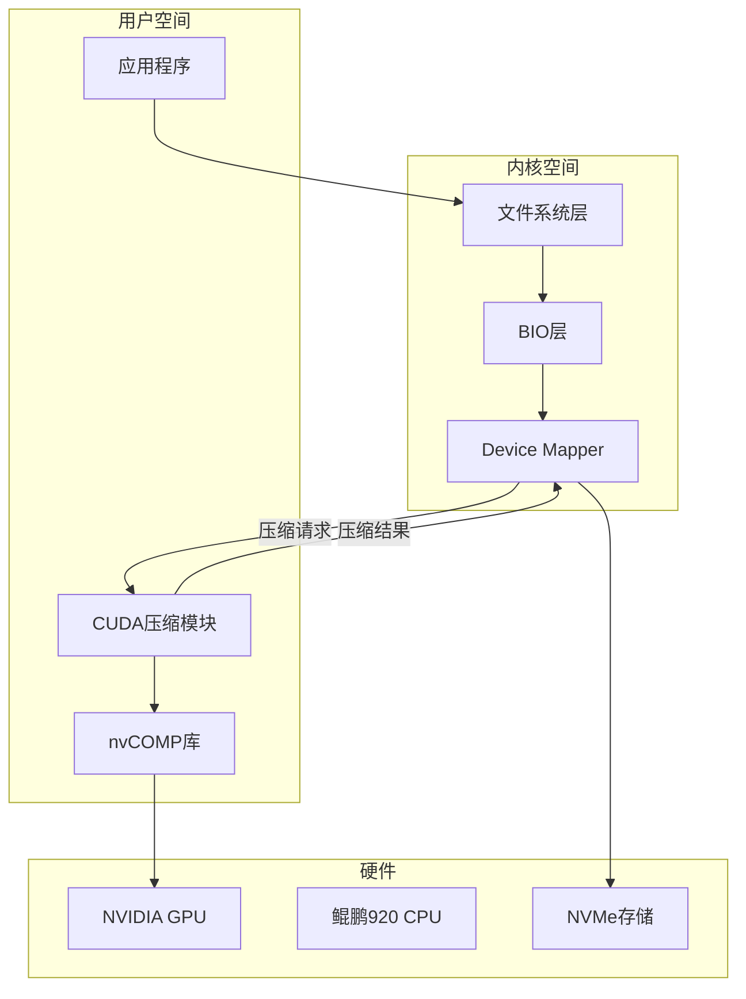

# GPU Off-Load 项目详细计划

## 一、项目概述

### 1.1 赛题信息
- **赛题名称**: 基于 GPU 的服务资源卸载技术探索
- **英文名称**: Exploration of GPU-based Service Resource Off-loading Technology
- **难度等级**: A（工程型）
- **比赛**: 2026年全国大学生计算机系统能力大赛-操作系统设计赛-OS功能挑战赛道

### 1.2 核心目标
通过 GPU offload 将存储系统中的压缩/解压等计算密集型任务卸载到GPU，减少主CPU资源消耗，提升整体系统性能。

### 1.3 应用场景
- 高性能存储服务器（全闪存存储）
- 数据库应用场景
- 计算密集型业务场景

## 二、技术方案

### 2.1 方案对比

| 方案 | 实现位置 | 优点 | 缺点 |
|------|----------|------|------|
| dm压缩 | Block层 | 支持多种文件系统（xfs、ext4等） | 无内容感知 |
| btrfs/zfs压缩 | 文件系统层 | 内容感知，压缩效率高 | 锁定特定文件系统 |

### 2.2 推荐技术路线



### 2.3 核心模块设计

#### 2.3.1 GPU压缩引擎模块
- 基于nvCOMP库实现
- 支持多种压缩算法（LZ4、ZSTD、DEFLATE等）
- 异步压缩/解压接口

#### 2.3.2 Device Mapper压缩模块
- 实现dm-compress目标
- 与内核块层集成
- 支持透明压缩

#### 2.3.3 用户空间-内核通信
- 使用ioctl或netlink通信
- DMA缓冲区管理
- 零拷贝优化

## 三、环境搭建计划

### 3.1 硬件要求
- GPU: NVIDIA RTX 3060/4060/5060
- CPU: 华为鲲鹏920 (aarch64架构)
- 内存: 建议32GB以上
- 存储: NVMe SSD

### 3.2 软件环境

```bash
# 操作系统
- Linux发行版: Ubuntu 22.04/24.04 或 openEuler

# GPU驱动和SDK
- NVIDIA Driver: 535+
- CUDA Toolkit: 12.x
- nvCOMP库

# 开发工具
- GCC/Clang
- Make/CMake
- Git

# 内核开发
- Linux内核源码
- 内核头文件
- 模块开发工具

# 测试工具
- fio
- vdbench
- perf
- sar
```

### 3.3 环境搭建步骤

1. **安装NVIDIA驱动和CUDA**
```bash
# 安装NVIDIA驱动
sudo apt install nvidia-driver-535

# 安装CUDA Toolkit
wget https://developer.download.nvidia.com/compute/cuda/repos/ubuntu2204/arm64/cuda-ubuntu2204.pin
sudo mv cuda-ubuntu2204.pin /etc/apt/preferences.d/cuda-repository-pin-600
sudo apt-key adv --fetch-keys https://developer.download.nvidia.com/compute/cuda/repos/ubuntu2204/arm64/3bf863cc.pub
sudo add-apt-repository "deb https://developer.download.nvidia.com/compute/cuda/repos/ubuntu2204/arm64/ /"
sudo apt update
sudo apt install cuda
```

2. **安装nvCOMP**
```bash
# 从NVIDIA GitHub获取
git clone https://github.com/NVIDIA/CUDALibrarySamples.git
cd CUDALibrarySamples/nvCOMP
```

3. **准备内核开发环境**
```bash
# 安装内核头文件和开发工具
sudo apt install linux-headers-$(uname -r) build-essential
```

## 四、开发计划

### 4.1 阶段一：环境搭建与调研
- [ ] 搭建开发环境
- [ ] 研究Linux内核dm模块
- [ ] 研究nvCOMP库API
- [ ] 研究ZFS QAT加速实现

### 4.2 阶段二：核心模块开发
- [ ] 实现GPU压缩引擎（用户空间）
- [ ] 实现dm-compress内核模块
- [ ] 实现用户空间-内核通信接口
- [ ] 集成测试

### 4.3 阶段三：测试与优化
- [ ] 功能测试
- [ ] 性能测试（fio、vdbench）
- [ ] 资源消耗分析
- [ ] 性能优化

### 4.4 阶段四：文档与提交
- [ ] 编写完整文档
- [ ] 准备DEMO
- [ ] 准备提交材料

## 五、性能测试计划

### 5.1 测试场景
1. 纯CPU压缩性能基准
2. GPU offload压缩性能
3. 不同压缩算法对比
4. 不同块大小对比

### 5.2 测试指标
- 吞吐量（MB/s）
- IOPS
- CPU利用率
- 内存使用量
- GPU利用率
- 压缩率
- 延迟

### 5.3 测试工具
- fio: I/O性能测试
- vdbench: 存储性能测试
- perf: CPU性能分析
- nvidia-smi: GPU监控
- sar: 系统资源监控

## 六、项目结构

```
GPU-Off-Load/
├── PROGRESS.md              # 进度记录
├── plans/                   # 计划文档
│   └── project-plan.md
├── docs/                    # 项目文档
│   ├── design.md           # 设计文档
│   ├── environment.md       # 环境搭建
│   ├── api.md              # API文档
│   ├── test-report.md      # 测试报告
│   ├── performance.md      # 性能报告
│   └── deployment.md       # 部署指南
├── src/                     # 源代码
│   ├── kernel/             # 内核模块
│   │   └── dm-compress/    # dm压缩模块
│   ├── user/               # 用户空间工具
│   │   ├── gpu-compress/   # GPU压缩引擎
│   │   └── tools/          # 辅助工具
│   └── lib/                # 共享库
├── tests/                   # 测试脚本
│   ├── fio/                # fio测试配置
│   ├── vdbench/            # vdbench测试配置
│   └── scripts/            # 测试脚本
├── scripts/                 # 构建和部署脚本
└── README.md               # 项目说明
```

## 七、评审要点对照

### 7.1 创新性（重点）
- [x] 使用GPU通用算力处理压缩任务
- [x] 不锁定特定GPU型号
- [x] 不锁定GPU供应商
- [ ] 深入优化GPU性能

### 7.2 完整度
- [ ] 系统可运行
- [ ] 完整性能测试报告
- [ ] 测试用例覆盖完整
- [ ] 文档清晰可复现

### 7.3 DEMO质量
- [ ] 稳定性验证
- [ ] 性能对比展示

### 7.4 评分权重
- 功能实现: 30%
- 设计完整性与测试用例设计: 20%
- 性能测试: 20%

## 八、风险与应对

| 风险 | 影响 | 应对措施 |
|------|------|----------|
| GPU驱动兼容性 | 高 | 提前测试驱动版本，准备备选方案 |
| 内核模块开发难度 | 高 | 参考现有dm模块，逐步迭代 |
| 性能不达预期 | 中 | 多种优化策略，算法调优 |
| aarch64平台兼容性 | 中 | 在目标平台充分测试 |

## 九、参考资料

1. Linux内核源码
   - fs/btrfs/
   - Documentation/admin-guide/device-mapper/
   - drivers/md/

2. ZFS硬件加速
   - https://openzfs.org/wiki/ZFS_Hardware_Acceleration_with_QAT
   - https://github.com/openzfs/zfs/pull/13628

3. nvCOMP库
   - https://github.com/NVIDIA/CUDALibrarySamples/tree/master/nvCOMP

4. GRAID技术
   - https://graidtech.com/products/supremeraid-he

5. eBPF存储加速
   - https://github.com/xrp-project/XRP